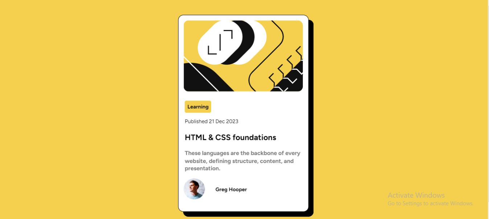

# Frontend Mentor - Blog preview card solution

This is a solution to the [Blog preview card challenge on Frontend Mentor](https://www.frontendmentor.io/challenges/blog-preview-card-ckPaj01IcS).

## Table of contents

- [Overview](#overview)
  - [The challenge](#the-challenge)
  - [Screenshot](#screenshot)
  - [Links](#links)
- [My process](#my-process)
  - [Built with](#built-with)
  - [What I learned](#what-i-learned)
  - [Continued development](#continued-development)
- [Author](#author)

## Overview

### The challenge

Users should be able to:

- See hover and focus states for all interactive elements on the page

### Screenshot

### Links

- Solution URL: [Add solution URL here](https://github.com/KrishnaPoddar1/Blogcards.git)
- Live Site URL: [Add live site URL here]( https://krishnapoddar1.github.io/Blogcards/)

## My process

### Built with

- CSS custom properties
- Flexbox
- CSS Grid
- Mobile-first workflow

### What I learned

It was for the first time that I used font-face. Apart from that all were similar to the previous challenge. I also used the hover state in this project. I also learned how to push an elemnt towards the user using the scale property.

### Continued development

Further Usage of Flexbox and grid components.

## Author

- Frontend Mentor - [@yourusername](https://www.frontendmentor.io/profile/KrishnaPoddar1)

